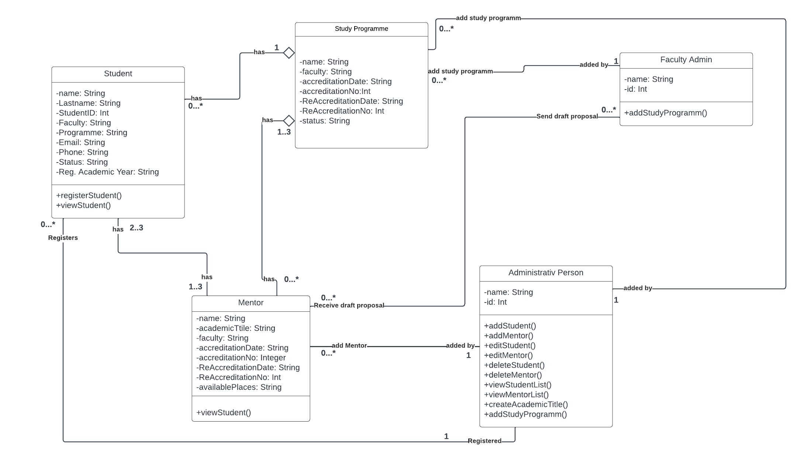

# 1. Software Engineering Project

### 1. Introduction
The project is a web-based system for managing PhD programs. The system has three types of actors: Students, Mentors, and Administrative Persons (AP). The system allows students to register themselves or be added by an AP, and view a list of available mentors for their study program. Mentors can send a Draft Proposal to the Faculty Admin, upload the student's First Presentation, and decide on the approval of the doctoral thesis topic and upload the related documents. The AP can add, update, or view Mentors, Students, or Student Progress, and can add Accredited Mentors, create Academic Titles, and add Accredited Study Programs. The system is designed to be user-friendly, secure, reliable, scalable, and maintainable. The project involves a number of functional and non-functional requirements that need to be met to ensure the system meets the needs of its users.

###  Classes
Student Class:
    -Registers a student into the system with required information
    -Allows students to view their information (name, ID, academic year, faculty, study program) and a list of available mentors for their study program
    -Provides authentication for students to login and access their information
Mentor Class:
    -Sends Draft Proposal to Faculty Admin for approval
    -Uploads the student's First Presentation
    -Approves the doctoral thesis topic and uploads the related documents
    -Provides authentication for mentors to login and view their list of students
Administrative Person (AP) Class:
    -Adds students to the system and assigns an accredited mentor
    -Updates student progress and status
    -Adds and manages Accredited Mentors, Academic Titles, and Accredited Study Programs
    -Searches and views a list of all students in the system
    -Provides authentication for AP to login and access the PhD Program Screen
Faculty Admin Class:
    -Adds and manages Accredited Study Programs
    -Approves or disapproves the Draft Proposal sent by mentors
    -Uploads the approved Draft Proposal and doctoral thesis topic related documents
    -Provides authentication for Faculty Admin to login and perform their actions
Study Program Class:
    -Stores information related to an accredited study program (name, type, duration, courses, etc.)
    -Allows AP to add new study programs or update existing ones
    -Provides data for other classes to use when needed
Draft Proposal Class:
    -Stores information related to a draft proposal (title, mentor, student, summary, etc.)
    -Allows mentors to send proposals to Faculty Admin for approval and provides the Faculty Admin with necessary data to make a decision
First Presentation Class:
    -Stores information related to a student's first presentation (title, mentor, student, summary, date, etc.)
    -Allows mentors to upload a student's First Presentation and notifies the Coordinator of the PhD program

###  Use Case Diagram

Description:

•	The system has 3 types of actors: Student, mentor, and Administrative Person (AP).
•	The student can register themselves or an AP can add a student to the system.
•	During registration, certain fields will only be visible to the AP.
•	The AP must login through the Login Form before they can access the PhD Program Screen, where they  can select to add, update, or view Mentors, Students, or Student Progress.
•	The List All Students Form allows the AP to search for a student by ID and add a new student.
•	The AP can also add Accredited Mentors, create Academic Titles, and add Accredited Study Programs.
•	A student can login and view a list of available mentors for their study program.
•	The mentor can send a Draft Proposal to the Faculty Admin, who can approve and upload it to the system.
•	The mentor can also upload the student's First Presentation, which will notify the Coordinator of the PhD program.
•	The mentor can then decide on the approval of the doctoral thesis topic and upload the documents.

###  Class Diagram

Description:

The main actors in the system are the Student and the Administrative Person (AP). The system allows for two main use cases: student registration and administrative actions.
1)	Student registration:
•	The student can initiate the registration process by clicking "I am a student" in the login form.
•	The student fills out the registration form, with certain fields remaining hidden until an accredited mentor is assigned.
2)	Administrative actions:
•	AP login through the "Login Form"
•	AP navigated to the PhD Program Screen
•	AP can select to perform actions on Mentors, Students or Student Progress.
•	AP can view and search a list of all students
•	AP can add a new student by navigating to the "Student Registration Form"
•	AP can add accredited mentors by navigating to the "List All Mentors" screen and clicking the "Add Mentor" button.
•	AP can create academic titles by navigating to the "Create Academic Title" form.
•	AP can add a study program by navigating to the "List of Accredited Programs" screen and selecting "Add Accredited Study Program"
3)	Student specific actions:
•	A student can see list of available mentors and contact them via email
•	A student can see their information like name, ID, academic year, faculty, study program and list of available mentors for him/her corresponding study program.
4)	Mentor specific actions:
•	A mentor can send the “Draft Proposal” to the Faculty Admin
•	A mentor can upload the First Presentation of the student
•	A mentor logs in, and he can see list of students that they have. Once he has selected the student,
5)	Faculty Admin specific actions:
•	Add study programs
•	Upload the document in the system

### Unit Testing

  -Student Registration Testing
 public function testStudentRegistration()
{
   

    $data = [
        'name'=> 'Jessica',
        'LastName'=>'Joan',
        'studentId'=>'08229211',
        'faculty'=>'CST',
        'Programme'=>'Computer Science',
        'Academic_Year'=>'20/21',
        'email'=>'jessica@hotmail.com',
        'phone'=>'+38928457198',
        'status'=>'Active',
    ];

    $response = $this->json('POST', '/applicants', $data);

    $response->assertRedirect('/applicants');

    $this->assertDatabaseHas('applicants', [
        'name'=> 'Jessica',
        'LastName'=>'Joan',
        'studentId'=>'08229211',
        'faculty'=>'CST',
        'Programme'=>'Computer Science',
        'Academic_Year'=>'20/21',
        'email'=>'jessica@hotmail.com',
        'phone'=>'+38928457198',
        'status'=>'Active',
    ]);
}

 -Student Update Testing

 public function a_student_can_be_updated()
    {
        $applicant = new Applicant();
        $student = $applicant->create();

        $data = [
            'name'=> 'Jessica',
            'LastName'=>'Jooan',
            'studentId'=>'092221',
        ];

        $response = $this->json('PUT', '/applicants/{applicant}'.$student->id, $data);

        $response->assertStatus(200)
                 ->assertJson([
                    'status' => 'success',
                    'message' => 'Student successfully updated.'
                 ]);

        $this->assertDatabaseHas('students', [
            'id' => $student->id,
            'name'=> 'Jessica',
            'LastName'=>'Jooan',
            'studentId'=>'092221',
        ]);
    }

 -Student Delete testing

  public function a_student_can_be_deleted()
    {
       
        $applicant = new Applicant();
        $student = $applicant->create();

        $response = $this->delete('/applicants/{applicant}'.$student->studentId);

        $response->assertStatus(204);

        $this->assertDatabaseMissing('students', [
            'studentId' => $student->studentId,
        ]);
    }

